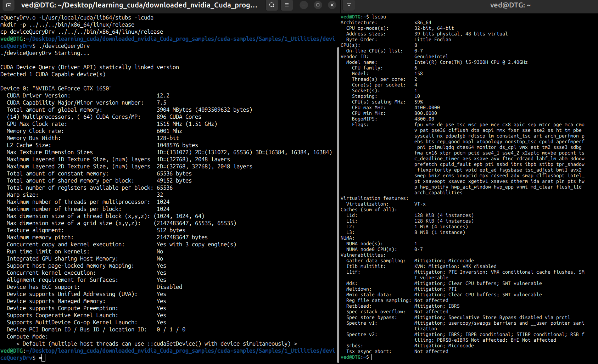

# CUDA programming tutorials

Notes and small programs while learning CUDA: basics, a CMake template for CUDA projects, and reference material.



## Layout

| Path | Role |
| --- | --- |
| [`Basics/`](Basics/) | Early CUDA exercises (includes a nested README) |
| [`Cmake_template_for_CUDA/`](Cmake_template_for_CUDA/) | CMake starter for CUDA |
| [`References/`](References/) | Notes and links |

Keep empty `build/` directories in git with a `.gitignore` such as:

```
*
!.gitignore
```
